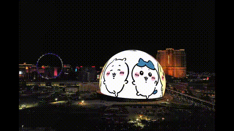

# Las Vegas Sphere Simulator

ラスベガスにある巨大な球体「MSG Sphere」を見て、「これ、自分でも作れるんじゃない？」と思って作った練習プロジェクトです。

## きっかけ

ネットで流れてきた Sphere の画像を見て、なんかカッコいいなと思っただけです。深い理由はありません。

## できること

- 好きな画像や GIF を球体に貼り付けて表示
- いろんな表示エフェクト（CRT、LED、ネオンなど）
- 球体がゆっくり回転する

## 使い方

```bash
npm install
npm run dev
```

ブラウザで開いて、右側のパネルから画像をアップロードするだけ。

## デモ



## 注意

これは遊びで作ったものなので、本物の Sphere とは全然違います。あしからず。

---

*ただの暇つぶしプロジェクトです*
